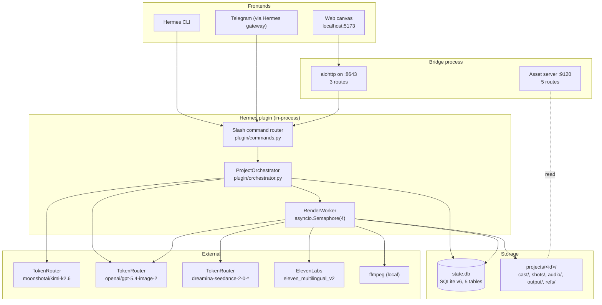
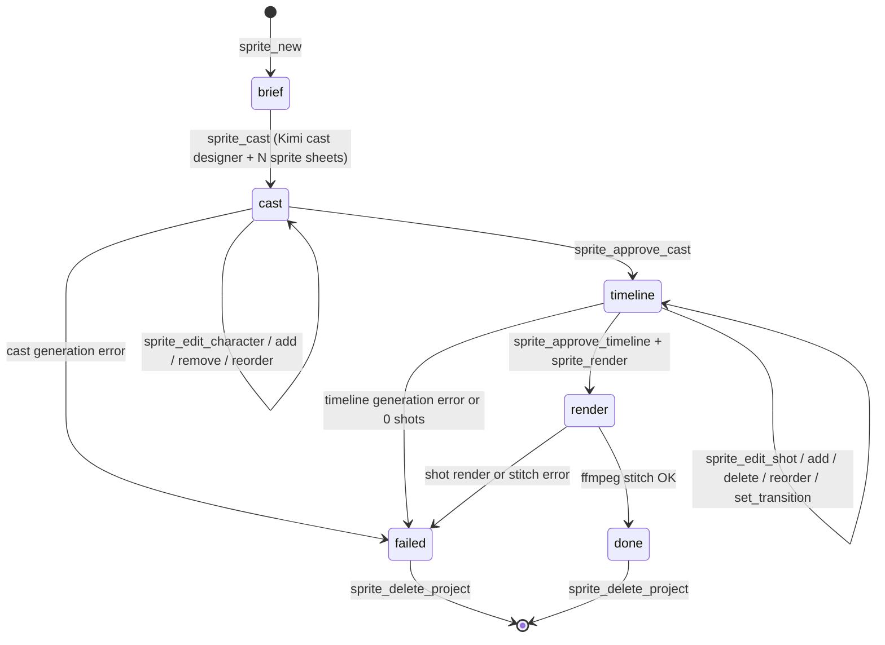
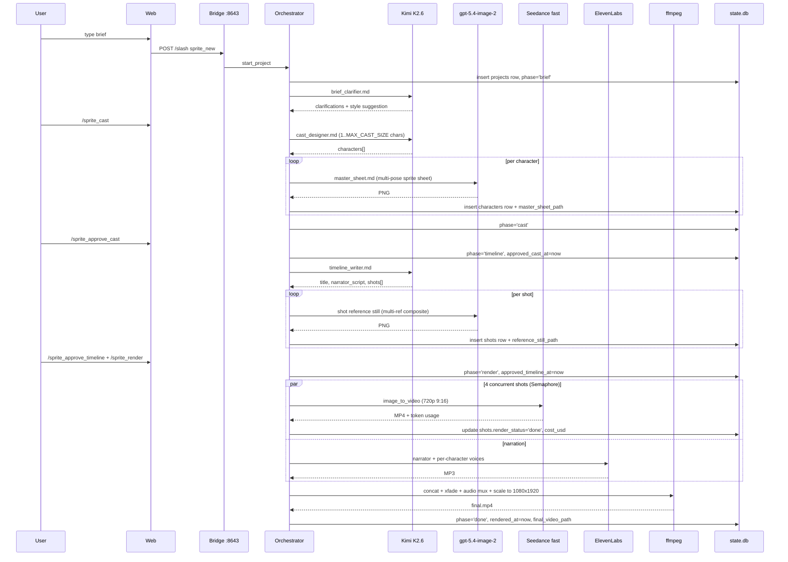
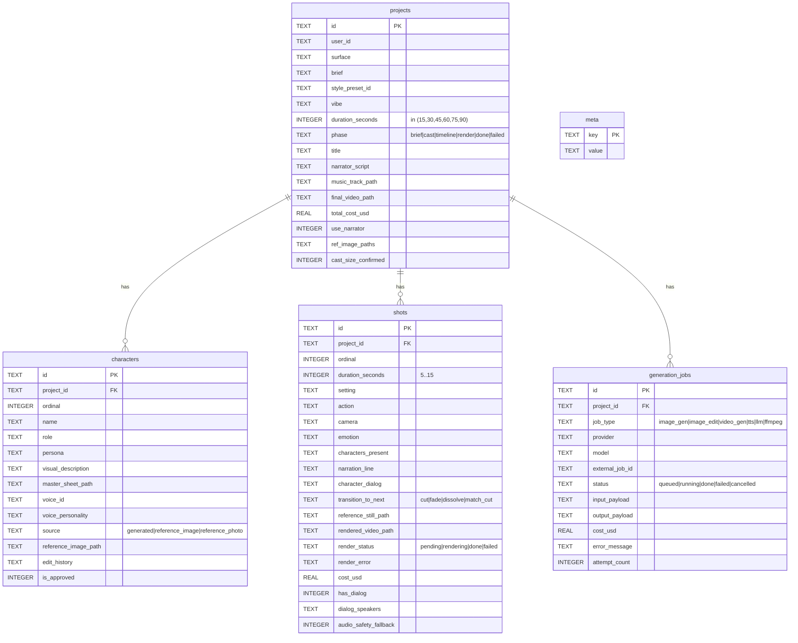

# 🏛️ Sprite Studio Architecture

Three pieces in three processes share one source of truth: a Hermes plugin (the brain), a bridge (the HTTP face), and a web canvas (the chat UI). Every project state lives in a SQLite file at `~/.hermes/plugins/sprite-studio/state.db`. Rendered media lives next to it under `~/.hermes/plugins/sprite-studio/projects/<project_id>/`.

## 🗺️ System overview



## 📂 Directory structure

The tree below is `find . -maxdepth 3 -type d` filtered against `.gitignore`. Anything ignored (`plugin/state.db`, `plugin/projects/`, `plugin/run/`, `plugin/cron/`, `plugin/music_library/`, `web/_design_reference/`, `build_prompts/`, `node_modules/`, `dist/`, `.env*`) does not appear here.

```
sprite-studio/
├── bridge/
│   ├── server.py          aiohttp app + asset_server lifecycle
│   ├── run.sh             standalone bridge launcher
│   └── run-assets.sh      standalone asset server launcher
├── plugin/
│   ├── __init__.py        plugin entrypoint, env preflight
│   ├── commands.py        SLASH_COMMANDS dict (30 entries)
│   ├── orchestrator.py    brief/cast/timeline orchestration
│   ├── db.py              SQLite migrations + repository functions
│   ├── env.py             dotenv resolution helpers
│   ├── models.py          pydantic models, size caps
│   ├── style_presets.py   YAML loader
│   ├── style_presets.yaml 10 presets
│   ├── plugin.yaml        Hermes manifest (name, version, requires_env)
│   ├── requirements.txt
│   ├── prompts/
│   │   ├── brief_clarifier.md
│   │   ├── cast_designer.md
│   │   ├── character_edit.md
│   │   ├── master_sheet.md
│   │   ├── shot_edit.md
│   │   └── timeline_writer.md
│   ├── services/
│   │   ├── _http.py             httpx clients + timeouts (DEFAULT, LLM)
│   │   ├── _retry.py            retry/backoff helper
│   │   ├── _concurrency.py      module-level Semaphores (image=6, chat=4, video=4, tts=4)
│   │   ├── _pricing.py          per-model $/M-token tables
│   │   ├── errors.py            ProviderError, ContentPolicyError, AudioSafetyError, ...
│   │   ├── tokenrouter.py       Kimi K2.6 chat client
│   │   ├── gpt_image.py         openai/gpt-5.4-image-2 client (gen + edit)
│   │   ├── seedance.py          dreamina-seedance-2-0-* image-to-video client
│   │   ├── elevenlabs.py        TTS client + narration synthesizer
│   │   ├── elevenlabs_voices.py voice catalog + personality-based picker
│   │   └── ffmpeg_runner.py     concat + xfade + audio mux
│   └── workers/
│       ├── render_worker.py     asyncio render pipeline + watchdog
│       └── asset_server.py      static media server with bearer-protected upload
├── web/
│   └── src/
│       ├── App.tsx
│       ├── main.tsx
│       ├── components/
│       │   ├── chrome/        Backdrop, ChatDock, CharacterCard, Header
│       │   ├── phases/        BriefScreen, CastScreen, TimelineScreen, RenderScreen, DoneScreen, LobbyScreen, PhaseCanvas
│       │   ├── popovers/      CharacterAddPopover, CharacterEditPopover, ShotEditPopover, TransitionPopover, PopoverHost
│       │   ├── sprites/       ProjectThumb, ShotStill, SpriteCell, SpriteSheet
│       │   ├── timeline/      CharacterAnchor, ConnectorOverlay, ShotCard, TimeAxis, TransitionPill
│       │   └── widgets/       RefDropZone, StyleSwatch
│       ├── lib/               bridge.ts, assets.ts, briefEncoding.ts, constraints.ts, design.ts, shotMath.ts, styleVisuals.ts, uploads.ts
│       ├── state/             store.ts (zustand)
│       └── types/             types.ts
├── scripts/
│   ├── run-bridge.mjs    venv-aware bridge launcher
│   ├── kill-bridge.sh    stop the bridge by PID file
│   ├── setup.mjs         npm install in root + web
│   └── preflight.mjs     env / venv readiness check
├── docs/                 demo media placeholder
├── DEV.md
├── README.md
├── ARCHITECTURE.md
├── SPRITE_STUDIO_BLUEPRINT.md
├── REFERENCE_DOCUMENTATION_AUDIT.md
├── REFERENCE_SECURITY_AUDIT.md
├── LICENSE                MIT
├── package.json           workspace root, dev/build/lint/typecheck scripts
├── package-lock.json
├── .env.example
└── .gitignore
```

## 🔄 Phase state machine

The `projects.phase` column is a SQLite TEXT with a CHECK constraint at `plugin/db.py:113`:

```
phase TEXT NOT NULL CHECK (phase IN ('brief','cast','timeline','render','done','failed'))
```

Six valid states. Every transition is an UPDATE through `db.set_phase()` (`plugin/db.py:851`).



`sprite_cancel` and the watchdog set a cancellation flag that the render loop polls. They write `error_message` and mark in-flight `generation_jobs` rows as `status='cancelled'` (the `generation_jobs.status` column does include `'cancelled'` per `plugin/db.py:186`), but they leave the project's `phase` at `render` so a re-run can resume. `'cancelled'` is reported through the in-memory `RenderResult` and the SSE-style progress bus, never persisted to `projects.phase`.

## 🧬 Component details

### Bridge (`bridge/server.py`)

Single aiohttp app listening on port 8643 (`SPRITE_BRIDGE_PORT`).

| Method | Path | Handler |
|--------|------|---------|
| GET | `/health` | liveness + plugin-loaded check |
| POST | `/slash` | dispatch a registered slash command |
| DELETE | `/projects/{project_id}` | cascade-delete a project (web lobby trash) |

Auth: every non-health request must carry `Authorization: Bearer <API_SERVER_KEY>`. The bridge backfills `API_SERVER_KEY` from `~/.hermes/.env` if absent in the process env (`bridge/server.py:70`).

Process lifecycle: a PID file at `~/.hermes/plugins/sprite-studio/run/bridge.pid` plus an `flock`'d `bridge.lock` make `npm run dev:bridge` self-healing in the face of stale orphans. `_preflight_cleanup` kills any process holding port 8643 or 9120 before binding.

The bridge starts the asset server in the same process via `app.on_startup.append(_start_asset_server)`. Failure to bind 9120 is logged but does not take the bridge down (assumes a standalone `asset_server.py` is already up).

### Asset server (`plugin/workers/asset_server.py`)

Separate aiohttp app on port 9120.

| Method | Path | Handler |
|--------|------|---------|
| GET | `/health` | liveness |
| OPTIONS | `/{project_id}/refs/upload` | CORS preflight |
| POST | `/{project_id}/refs/upload` | Bearer-protected reference image upload |
| GET | `/{project_id}/{subdir}/{rest:.*}` | serve cast/, shots/, audio/, output/, refs/ |
| OPTIONS | `/{tail:.*}` | catch-all CORS preflight |

`project_id` must match the Crockford-base32 ULID regex (`^[0-9A-HJKMNP-TV-Z]{26}$`, no I/L/O/U) before any path resolution. `subdir` is locked to a hardcoded allowlist; `_trash`, `_debug`, and any other path is rejected with 400. The CORS origin defaults loosely for dev; set `SPRITE_STUDIO_ASSET_CORS_ORIGIN` for tunneled or production setups.

### Orchestrator (`plugin/orchestrator.py`)

3,435-line module. Owns the brief/cast/timeline lifecycle. The render lifecycle delegates to `workers/render_worker.py`.

Key constants:
- `KIMI_MODEL = "moonshotai/kimi-k2.6"` (`orchestrator.py:53`)
- `DEFAULT_DURATION_SECONDS = 60` (`orchestrator.py:54`)

Idempotency contracts:
- `sprite_cast` re-runs cleanly: existing characters are deleted before regeneration unless the user hit `/sprite_edit_character`.
- `sprite_timeline` is single-pass; on partial failure it leaves the project in `phase='timeline'` with `error_message`.
- `sprite_approve_cast_size` is required only above `HARD_WARN_CAST_SIZE=12`. Below that, `sprite_approve_cast` advances directly.

### Render worker (`plugin/workers/render_worker.py`)

`RenderWorker` is constructed once per render. It owns:

- `shot_sema = asyncio.Semaphore(MAX_SHOT_CONCURRENCY)` where `MAX_SHOT_CONCURRENCY = 4`.
- A watchdog task that fires `max_render_seconds` after submit and sets the cancel flag.
- The `PROGRESS_BUS` event stream (consumed by `sprite_status` polling).

Shot pipeline per shot:

1. Build the multi-character prompt (style descriptor + setting + action + camera + emotion + dialog flag).
2. Call `seedance.image_to_video` with `resolution="720p"`, `ratio="9:16"`, the shot's reference still, and `has_dialog` flag.
3. On `SeedanceAudioSafetyError`, retry once with `generate_audio=False` (audio-safety fallback, schema v6 column `shots.audio_safety_fallback`). The retry submits a fresh Seedance task with its own cost.
4. On `ProviderContentPolicyError`, mark shot failed (no retry).
5. Record `cost_usd` from the provider's `completion_tokens` count via `_pricing.seedance_cost_from_tokens`.

Narration runs in a parallel task. Music selection scans `music_library/<music_tag>/` and picks one randomly; if the directory is missing the stitch proceeds without music.

Stitch (`services/ffmpeg_runner.py`) normalizes every shot to `DEFAULT_RESOLUTION = (1080, 1920)`, applies the per-shot transition (`cut`, `fade`, `dissolve`, or `match_cut`), mixes narration + character dialog + music, and writes `projects/<id>/output/final.mp4`.

### Services (`plugin/services/`)

| File | Provider | Models | Timeout |
|------|----------|--------|---------|
| `tokenrouter.py` | TokenRouter | `moonshotai/kimi-k2.6` | `LLM_TIMEOUT` (read=600s) |
| `gpt_image.py` | TokenRouter (proxies OpenAI) | `openai/gpt-5.4-image-2` | `DEFAULT_TIMEOUT` (read=120s) |
| `seedance.py` | TokenRouter (proxies Dreamina) | `dreamina-seedance-2-0-fast-260128`, `dreamina-seedance-2-0-260128` | `DEFAULT_TIMEOUT` |
| `elevenlabs.py` | ElevenLabs direct | `eleven_multilingual_v2` | `DEFAULT_TIMEOUT` |
| `elevenlabs_voices.py` | ElevenLabs direct | (voice catalog) | `DEFAULT_TIMEOUT` |
| `ffmpeg_runner.py` | local `ffmpeg` | n/a | per-call |

Module-level concurrency caps in `_concurrency.py`:

```python
IMAGE_SEMAPHORE = asyncio.Semaphore(6)
CHAT_SEMAPHORE  = asyncio.Semaphore(4)
VIDEO_SEMAPHORE = asyncio.Semaphore(4)
TTS_SEMAPHORE   = asyncio.Semaphore(4)
```

Errors live in `services/errors.py`. `RenderWorker._render_inner` catches `ProviderContentPolicyError`, `SeedanceAudioSafetyError`, and falls through to a generic exception path that marks the shot or project failed with a sanitized error message.

### Web app (`web/src/`)

40 TS/TSX files under `web/src/`.

State: a single zustand store at `state/store.ts`. Notable fields:
- `activeProjectId: ULID | null`
- `viewedPhase: ProjectPhase | null`. When set, the web shows the phase canvas at that prior phase as read-only on a `done` or `failed` project.
- `pollIntervalMs`. Drives the `sprite_status` poll loop (no SSE; the bridge has no event endpoint).

Bridge client: `lib/bridge.ts` does plain `fetch` with `Bearer ${VITE_SPRITE_BRIDGE_KEY}` and an `AbortController` timeout. `lib/assets.ts` resolves asset URLs against `VITE_ASSET_BASE_URL`.

dnd-kit usage: `@dnd-kit/sortable` powers shot reorder in `TimelineScreen` and character reorder in `CastScreen`. The orchestrator side of these is two-pass updates that park ordinals at `+100000` to dodge the `UNIQUE (project_id, ordinal)` constraint mid-write (`plugin/db.py:944`).

Read-only banner: `Header.tsx` shows `◷ read-only` and `ChatDock.tsx` blocks input when `viewedPhase` differs from the project's live phase.

## 📊 Data flow: brief → final.mp4



## 🗄️ Database schema

`SCHEMA_VERSION = 6` (`plugin/db.py:1`). 5 tables created idempotently from `_SCHEMA_SQL`, then 5 incremental migrations (`_migration_v2_dialog_flags` through `_migration_v6_audio_safety_fallback`).



PRAGMAs on every connection (`plugin/db.py:215`):

```
journal_mode = WAL
busy_timeout = 10000
synchronous  = NORMAL
foreign_keys = ON
```

`ON DELETE CASCADE` on `characters.project_id`, `shots.project_id`, `generation_jobs.project_id`. `delete_project_cascade` (`plugin/db.py:646`) explicitly deletes jobs first, then shots, then characters, then the project row, mirroring the cascade order so partial failures leave a recoverable state.

## 🔐 Trust boundaries

| Boundary | Threat | Mitigation |
|----------|--------|------------|
| Web → Bridge `/slash` | Unauthenticated localhost access | `Authorization: Bearer <API_SERVER_KEY>` required on every non-health route |
| Web → Bridge `DELETE /projects/{id}` | Mass deletion via crafted `project_id` | ULID regex guard at `bridge/server.py:491` (Crockford base32, no I/L/O/U) before any DB call |
| Bridge → Asset FS | Path traversal via `project_id` or `subdir` | ULID regex on `project_id`, hardcoded `subdir` allowlist, `Path.resolve()` containment check inside `serve_asset` |
| Asset upload | Unbounded reference image storage | Bearer auth on POST upload, ULID regex on `project_id`, generated filename is a fresh ULID |
| Plugin → External APIs | Key exposure | `TOKENROUTER_API_KEY` and `ELEVENLABS_API_KEY` resolved through `env.require_env()` (process env then `~/.hermes/.env`); never sent to the frontend |
| Web env (`VITE_*`) | Bridge key in browser bundle | Acceptable: bridge is `127.0.0.1`-bound by default; running with `SPRITE_BRIDGE_HOST=0.0.0.0` exposes the bearer key in the JS bundle to anyone on the network. Documented in `.env.example`. |
| LLM output → Image prompt | Prompt injection through user brief | Brief is passed verbatim into Kimi structured-output prompts; Kimi returns shape-validated JSON; raw user text never reaches the image API directly |

## 🧯 Failure modes

- **Provider 5xx.** `services/_retry.py` retries with exponential backoff up to a per-service attempt cap (3 for chat / image, 3 for TTS, 2 for the audio-safety fallback's second attempt).
- **Kimi reasoning timeout.** `LLM_TIMEOUT` is 600s read; longer reasoning surfaces as a `ProviderTimeoutError`. The orchestrator marks the project `failed` with the timeout reason; user reruns by replaying the same slash command.
- **Seedance audio safety.** First retry forces `generate_audio=False`. If that also fails, the shot is `failed` and the render continues. The narrator track covers any missing audio at stitch time.
- **Empty timeline.** `db.fail_stuck_timelines()` (`db.py:698`) is a recovery query that marks projects stuck at `phase='timeline'` with no shots as `failed`.
- **Watchdog cancel.** Exceeds `max_render_seconds`; sets the cancel flag, marks running jobs as `cancelled`, leaves the project at `phase='render'` with an `error_message`. A re-run resumes from the first non-`done` shot.
- **Asset bind conflict.** Bridge logs and continues on port 9120 conflict, assuming a standalone `asset_server.py` is already serving.
- **Missing music directory.** Stitch proceeds without music; `music_track_path` is left null.

## 🤝 Adding a new style preset

1. Append a YAML block to `plugin/style_presets.yaml` with `id`, `name`, `descriptor`, `render_notes`, `motion_descriptor`, `music_tag`, optional `example_image`.
2. Restart the bridge (`npm run dev:bridge`) so `style_presets.py` reloads the YAML.
3. The brief clarifier picks it up automatically. Force it on a single project with `/sprite_set_style <id>`.
4. Optional: drop CC0 tracks into `~/.hermes/plugins/sprite-studio/music_library/<music_tag>/` so the stitch step has something to mix in.

No source code edits required. The preset is just data.

## ⚖️ Design tradeoffs

- **SQLite vs Postgres.** SQLite chosen for zero-deploy. The asset server reads files locally, so a multi-host deployment would need a shared volume or a swap to S3-style storage.
- **TokenRouter vs direct providers.** Single billing surface, single auth header, fallback chain handled upstream. Adds one network hop (~30-50ms). The plugin still talks to ElevenLabs directly because the voice catalog API is provider-specific.
- **One LLM (Kimi) for everything.** Brief, cast, timeline, edits all go through `moonshotai/kimi-k2.6`. Single prompt format, single pricing curve, single retry policy. The downside is no model arbitrage: a longer Anthropic Claude or Gemini call could write better timelines but would require a second pricing track and prompt format.
- **Multi-reference compositing for shot stills.** Shot reference stills include every speaking character's master sheet as an `image[]` input to `gpt-5.4-image-2`. Locks character identity at ~$0.20-0.40/shot vs raw text-to-video where identity drifts shot to shot.
- **Polling vs SSE.** Web polls `sprite_status` every `pollIntervalMs`. No `/render-events` endpoint exists. Trade off: simpler bridge code (no SSE state to manage), more bytes on the wire during a render.
- **In-process asset server.** Same Python process as the bridge, separate aiohttp app, separate port. Simplifies dev (`npm run dev:bridge` brings both up); production would split them so a slow image stream cannot stall the slash router.
- **`viewedPhase` in zustand only.** Read-only past-phase navigation is a UI concept that does not need persistence. A browser refresh resets to the live phase, which matches user expectation when re-opening a `done` project.

## 📚 Cross-references

- [README.md](README.md): one-page overview, quick start, command list
- [DEV.md](DEV.md): developer ergonomics
- [SPRITE_STUDIO_BLUEPRINT.md](SPRITE_STUDIO_BLUEPRINT.md): frozen design spec
- [.env.example](.env.example): every supported env var with notes
- [LICENSE](LICENSE): MIT
