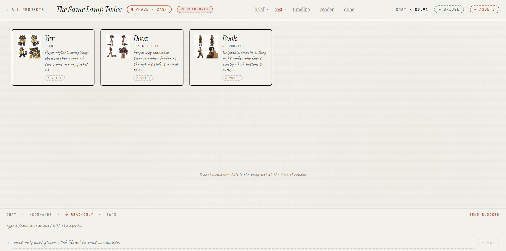
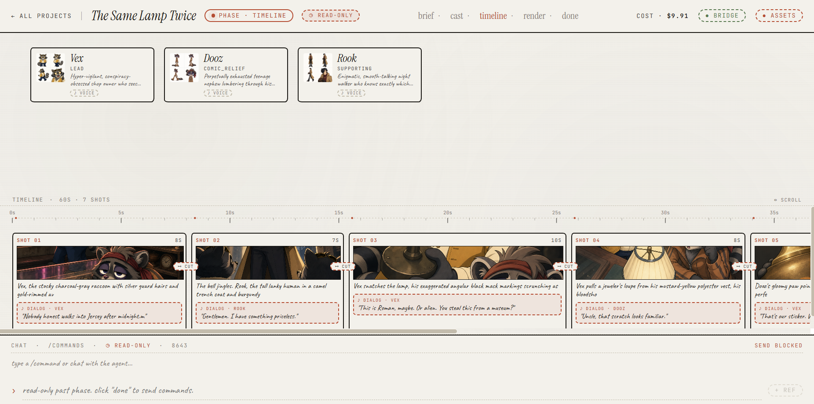
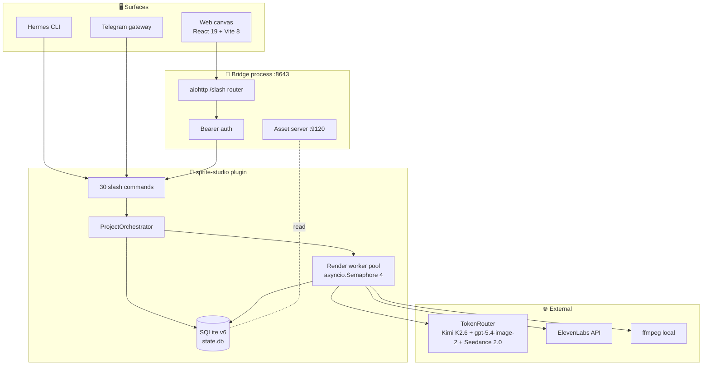

# 🎬 Sprite Studio

> A Hermes-powered AI video creation studio. Type a one-line brief, the agent designs the cast, you approve or chat-edit, and it renders a 15 to 90 second video with locked character consistency.

[](LICENSE)
[](https://github.com)
[](plugin/db.py)
[](https://nousresearch.com)

<!-- DEMO_PLACEHOLDER_HERO -->
<p align="center">
  
</p>
<p align="center"><sub>📹 Demo: brief to cast to timeline to render to done. 9:16 1080p portrait MP4.</sub></p>

## 🛠️ Tech stack

[](https://www.python.org)
[](https://www.typescriptlang.org)
[](https://react.dev)
[](https://vitejs.dev)
[](https://docs.aiohttp.org)
[](https://sqlite.org)
[](https://ffmpeg.org)
[](https://tailwindcss.com)
[](https://dndkit.com)
[](https://github.com/pmndrs/zustand)

**LLMs and media providers:**

[](https://moonshot.cn)
[](https://openai.com)
[](https://dreamina.ai)
[](https://elevenlabs.io)
[](https://tokenrouter.com)

## ⚡ Quick start

Prerequisites: Node 20.19+ or 22.12+, Python 3.11+ (the Hermes venv), `ffmpeg`, a TokenRouter account with access to Kimi K2.6, gpt-5.4-image-2, and Seedance 2.0, plus an ElevenLabs key for narration.

```bash
git clone https://github.com/Andy00L/sprite-studio.git
cd sprite-studio

# 1. Install the plugin into Hermes
cp -r plugin ~/.hermes/plugins/sprite-studio
pip install -r ~/.hermes/plugins/sprite-studio/requirements.txt

# 2. Configure secrets
cp .env.example ~/.hermes/.env
# edit ~/.hermes/.env: TOKENROUTER_API_KEY, ELEVENLABS_API_KEY, API_SERVER_KEY

# 3. Web app secrets
cp web/.env.example web/.env.local
# set VITE_SPRITE_BRIDGE_KEY to match API_SERVER_KEY

# 4. Install JS deps
npm install
cd web && npm install && cd ..

# 5. Run bridge + Vite
npm run dev
# bridge:        http://127.0.0.1:8643
# web canvas:    http://localhost:5173
# asset server:  http://127.0.0.1:9120
```

The bridge is a sidecar (`bridge/server.py`) that imports the plugin in-process and exposes its slash commands as REST endpoints. The asset server runs on a separate port in the same process and serves rendered media from `~/.hermes/plugins/sprite-studio/projects/<project_id>/...`.

## ✨ What it does

Type a brief like "two cats running a detective agency" and the agent walks five phases:

- **🎭 Cast.** Kimi K2.6 designs 1 to `MAX_CAST_SIZE=30` characters. Each gets a multi-pose master sheet from `openai/gpt-5.4-image-2`. A confirmation gate fires above `HARD_WARN_CAST_SIZE=12`.
- **🎬 Timeline.** One Kimi pass writes the title, narrator script, and N shots (`duration_seconds` per shot must be 5 to 15). Each shot rendered as a multi-character reference still on `gpt-5.4-image-2`.
- **🎥 Render.** Up to `MAX_SHOT_CONCURRENCY=4` concurrent Seedance image-to-video generations. Default model: `dreamina-seedance-2-0-fast-260128` at 720p 9:16 (override with `SPRITE_STUDIO_VIDEO_TIER=standard`). Audio-safety fallback retries once with `generate_audio=False` if the first attempt is rejected (schema v6).
- **🔊 Audio.** Per-character voices picked by personality from the live ElevenLabs catalog (`elevenlabs_voices.pick_voice`). Narrator default `JBFqnCBsd6RMkjVDRZzb`. Model `eleven_multilingual_v2`.
- **🪡 Stitch.** Local `ffmpeg` concats the shots, normalizes to 1080x1920 portrait, mixes narration + dialog + CC0 music if a matching `music_library/<music_tag>/` directory is present, otherwise falls through.

Other surface features:

- **💬 Chat-driven editing.** 30 slash commands across web, Hermes CLI, and Telegram (the Hermes gateway routes commands by registration, not per-surface code).
- **🗂️ Read-only past phases.** The web `viewedPhase` zustand field lets you click brief / cast / timeline / render on a `done` or `failed` project to inspect prior state without flipping the project's live phase.
- **🗑️ Lobby management.** `sprite_delete_project` cascades jobs to shots to characters to row, with a project-busy guard for in-flight renders (returns 409 from `DELETE /projects/{id}`).

<!-- DEMO_PLACEHOLDER_FEATURE_GRID -->
<p align="center">
  
  
</p>

## 🏗️ Architecture



See [ARCHITECTURE.md](ARCHITECTURE.md) for component-level detail, the phase state machine, and the data flow sequence.

## 📁 Project structure

```
sprite-studio/
├── bridge/                 aiohttp HTTP gateway + asset server boot
│   ├── server.py           3 routes: /health, /slash, /projects/{id}
│   ├── run.sh
│   └── run-assets.sh
├── plugin/                 vendored copy of the Hermes plugin
│   ├── commands.py         30 slash command handlers
│   ├── orchestrator.py     phase state machine, brief/cast/timeline orchestration
│   ├── db.py               SQLite, 5 tables, schema_version=6
│   ├── env.py              .env loader (process env > ~/.hermes/.env)
│   ├── models.py           pydantic dataclasses + size caps
│   ├── style_presets.py    YAML loader for style_presets.yaml
│   ├── style_presets.yaml  10 named visual styles
│   ├── plugin.yaml         Hermes plugin manifest
│   ├── requirements.txt
│   ├── prompts/            6 LLM prompt files
│   ├── services/           tokenrouter, gpt_image, seedance, elevenlabs, ffmpeg_runner
│   └── workers/            render_worker.py + asset_server.py
├── web/                    React 19 + Vite 8 web canvas
│   └── src/
│       ├── App.tsx
│       ├── components/     chrome, phases, popovers, sprites, timeline, widgets
│       ├── state/          zustand store (incl. viewedPhase)
│       ├── lib/            bridge HTTP client, asset URL builder, briefEncoding
│       └── types/
├── scripts/                run-bridge.mjs, kill-bridge.sh, setup.mjs, preflight.mjs
├── docs/                   media placeholder for the demo recording
├── README.md
├── ARCHITECTURE.md
├── DEV.md                  developer ergonomics notes
├── SPRITE_STUDIO_BLUEPRINT.md   frozen design spec
├── REFERENCE_DOCUMENTATION_AUDIT.md
├── REFERENCE_SECURITY_AUDIT.md
├── LICENSE
├── package.json            workspace scripts: dev, dev:bridge, dev:web, build, lint, typecheck
├── .env.example
└── .gitignore
```

## ⚙️ Configuration

Every variable is grepped from the source. Read locations cite the file.

| Variable | Required | Default | Read in | Description |
|----------|----------|---------|---------|-------------|
| `TOKENROUTER_API_KEY` | yes | (none) | `plugin/services/tokenrouter.py:49`, `seedance.py:152`, `gpt_image.py:53` | TokenRouter key for Kimi, gpt-5.4-image-2, Seedance |
| `ELEVENLABS_API_KEY` | yes | (none) | `plugin/services/elevenlabs.py:78`, `elevenlabs_voices.py:121` | ElevenLabs key for narration TTS and voice catalog |
| `API_SERVER_KEY` | yes | (none) | `bridge/server.py:546` | Bearer token shared by bridge `/slash` and the web app |
| `SPRITE_STUDIO_VIDEO_TIER` | no | `fast` | `plugin/env.py:107` | Seedance tier: `fast` or `standard` |
| `SPRITE_BRIDGE_HOST` | no | `127.0.0.1` | `bridge/server.py:553` | Bridge bind host |
| `SPRITE_BRIDGE_PORT` | no | `8643` | `bridge/server.py:554` | Bridge bind port |
| `SPRITE_PLUGIN_PATH` | no | `~/.hermes/plugins/sprite-studio` | `bridge/server.py:562` | Override the plugin location |
| `SPRITE_STUDIO_ASSET_CORS_ORIGIN` | no | (loose dev default) | `plugin/workers/asset_server.py:63` | CORS origin for the asset server |
| `VITE_SPRITE_BRIDGE_KEY` | yes (web) | (none) | `web/src/lib/bridge.ts` | Must match `API_SERVER_KEY` |
| `VITE_ASSET_BASE_URL` | no (web) | `http://127.0.0.1:9120` | `web/src/lib/assets.ts` | Asset server URL (override for tunneled / remote) |

`OPENAI_API_KEY`, `TELEGRAM_BOT_TOKEN`, and `TELEGRAM_ALLOWED_USERS` appear in `.env.example` for completeness but are not consumed by the plugin or bridge code in this tree.

## 🎨 Style presets

10 presets live in `plugin/style_presets.yaml`. Each carries a long visual descriptor, render notes, motion guidance, and a `music_tag` used to select the music directory at stitch time.

| ID | Name | Music tag |
|----|------|-----------|
| `cartoon_classic` | Classic Cartoon | `cartoon_upbeat` |
| `pixar_3d` | Pixar-Style 3D | `orchestral_warm` |
| `watercolor_book` | Watercolor Children's Book | `gentle_piano` |
| `anime_modern` | Modern Anime | `anime_emotional` |
| `cinematic_realism` | Cinematic Realism | `cinematic_strings` |
| `ghibli_inspired` | Hand-Drawn Painted (Ghibli-inspired) | `gentle_piano` |
| `pixel_art_retro` | Pixel Art Retro | `chiptune_adventure` |
| `noir_comic` | Noir Comic Book | `jazz_noir` |
| `storybook_3d` | Storybook 3D | `cozy_acoustic` |
| `cyberpunk_neon` | Cyberpunk Neon | `synth_dark` |

The brief clarifier proposes a preset for the brief; `/sprite_set_style <id>` overrides.

## 💸 Cost shape

Pricing constants live in `plugin/services/_pricing.py`.

| Model | Input ($/M tok) | Output ($/M tok) | Notes |
|-------|----------------|-----------------:|-------|
| `moonshotai/kimi-k2.6` | 0.95 | 4.00 | brief, cast, timeline, edits |
| `openai/gpt-5.4-image-2` | 8.00 | 30.00 | character master sheets, shot reference stills |
| `dreamina-seedance-2-0-fast-260128` | (single) | 5.60 | default video tier |
| `dreamina-seedance-2-0-260128` | (single) | 7.00 | `SPRITE_STUDIO_VIDEO_TIER=standard` |
| `eleven_multilingual_v2` | (notional) | $0.0003/char | narration + dialog |

Seedance bills `(width * height * duration_seconds * fps) / 1024` tokens. At the default 720p 9:16 (`1280x720`), 24 fps:

| Shot duration | Tokens | Fast tier | Standard tier |
|---------------|-------:|----------:|--------------:|
| 5 s | 108,000 | $0.60 | $0.76 |
| 8 s | 172,800 | $0.97 | $1.21 |
| 10 s | 216,000 | $1.21 | $1.51 |
| 15 s | 324,000 | $1.81 | $2.27 |

A 60s project with 6 shots of ~10 s each (default tier) lands around $7 to $8 on video alone, plus brief + cast + timeline LLM cost (~$0.05) and 1 to 3 master sheets (~$0.15 to $0.45). Heavy iteration runs land in the $15 to $25 range.

## 🧪 Slash commands

All 30 are registered in `plugin/commands.py`. Same set across web canvas, Hermes CLI, and the Telegram gateway.

```
start                                          generic Hermes /start handler

# Project lifecycle
sprite_new <brief>                             open a new project from a one-line brief
sprite_show [project_id]                       full project state (chars, shots, costs, errors)
sprite_status [project_id]                     concise progress (used by web polling)
sprite_list                                    list all projects in the lobby
sprite_cost_summary [project_id]               per-call cost rollup
sprite_purge                                   clear all done/failed projects
sprite_delete_project <project_id>             cascade-delete one project
sprite_cancel [project_id]                     stop an in-flight render

# Brief
sprite_set_style <preset_id>                   override the auto-picked style
sprite_set_vibe <vibe>                         set vibe (e.g. "cosy", "dramatic")
sprite_set_duration <seconds>                  15, 30, 45, 60, 75, or 90
sprite_set_project_refs <paths>                attach reference images
sprite_list_styles                             dump the 10 presets

# Cast phase
sprite_cast                                    (re)generate cast from current brief
sprite_edit_character <id> <text>              chat-edit a character (surgical or full regen)
sprite_add_character <description>             add a custom character
sprite_remove_character <id>                   remove a character
sprite_reorder_cast <id1> <id2> ...            two-pass reorder by ordinal
sprite_approve_cast                            advance to timeline
sprite_approve_cast_size                       confirm cast > HARD_WARN_CAST_SIZE

# Timeline phase
sprite_timeline                                generate (or regenerate) the timeline
sprite_edit_shot <n> <text>                    chat-edit a shot
sprite_edit_shot_field <n> <field> <value>     edit a single field
sprite_set_shot_transition <n> <type>          cut, fade, dissolve, or match_cut
sprite_add_shot                                append a shot
sprite_delete_shot <n>                         remove a shot
sprite_reorder_shots <n1> <n2> ...             two-pass reorder
sprite_approve_timeline                        advance to render

# Render
sprite_render                                  kick off the Seedance + ElevenLabs + ffmpeg pipeline
```

## 🧯 Known limitations

- The render pipeline writes 720p source frames to disk; the final `.mp4` is upscaled to 1080x1920 in `ffmpeg_runner.DEFAULT_RESOLUTION`. Native 1080p Seedance is supported but not the default.
- `music_library/<music_tag>/` directories are not bundled. If the directory for the picked preset is missing, the stitch step proceeds without music.
- The render watchdog cancels in-flight tasks after `max_render_seconds` but cannot rewrite the project's DB phase to `cancelled`; the project stays in `phase='render'` with an `error_message` so a re-run can resume. The DB CHECK constraint on `projects.phase` allows only `brief, cast, timeline, render, done, failed`.
- Read-only past-phase view stores `viewedPhase` in zustand only. A browser refresh resets it to the live phase.
- Audio-safety fallback (`audio_safety_fallback` shot column, schema v6) doubles the cost of the affected shot, since each retry is a fresh Seedance task.
- ElevenLabs voice catalog is fetched once at startup. If the API call fails, picks fall back to the local heuristic in `_select_fallback_locally`.

## 🤝 Contributing

```bash
npm run dev:bridge       # plugin bridge only
npm run dev:web          # vite only
npm run dev              # both, concurrently
npm run typecheck        # tsc --noEmit
npm run lint             # eslint web/
npm run build            # vite build
npm run check            # scripts/preflight.mjs (env + venv check)
npm run kill:bridge      # stop the bridge if it's wedged
```

`scripts/run-bridge.mjs` resolves the Hermes venv python, forwards POSIX signals, and exec's `bridge/server.py`. `scripts/preflight.mjs` (`npm run check`) verifies the venv path and required env vars without starting anything.

## 📚 Documentation

- [ARCHITECTURE.md](ARCHITECTURE.md): system overview, phase state machine, data flow sequence
- [DEV.md](DEV.md): developer ergonomics, common workflows
- [SPRITE_STUDIO_BLUEPRINT.md](SPRITE_STUDIO_BLUEPRINT.md): the frozen design spec the project was built against
- [.env.example](.env.example): every supported env var
- [LICENSE](LICENSE): MIT

## 🪪 License

MIT. See [LICENSE](LICENSE).

Built for the Hermes Creative Hackathon, May 2026.
